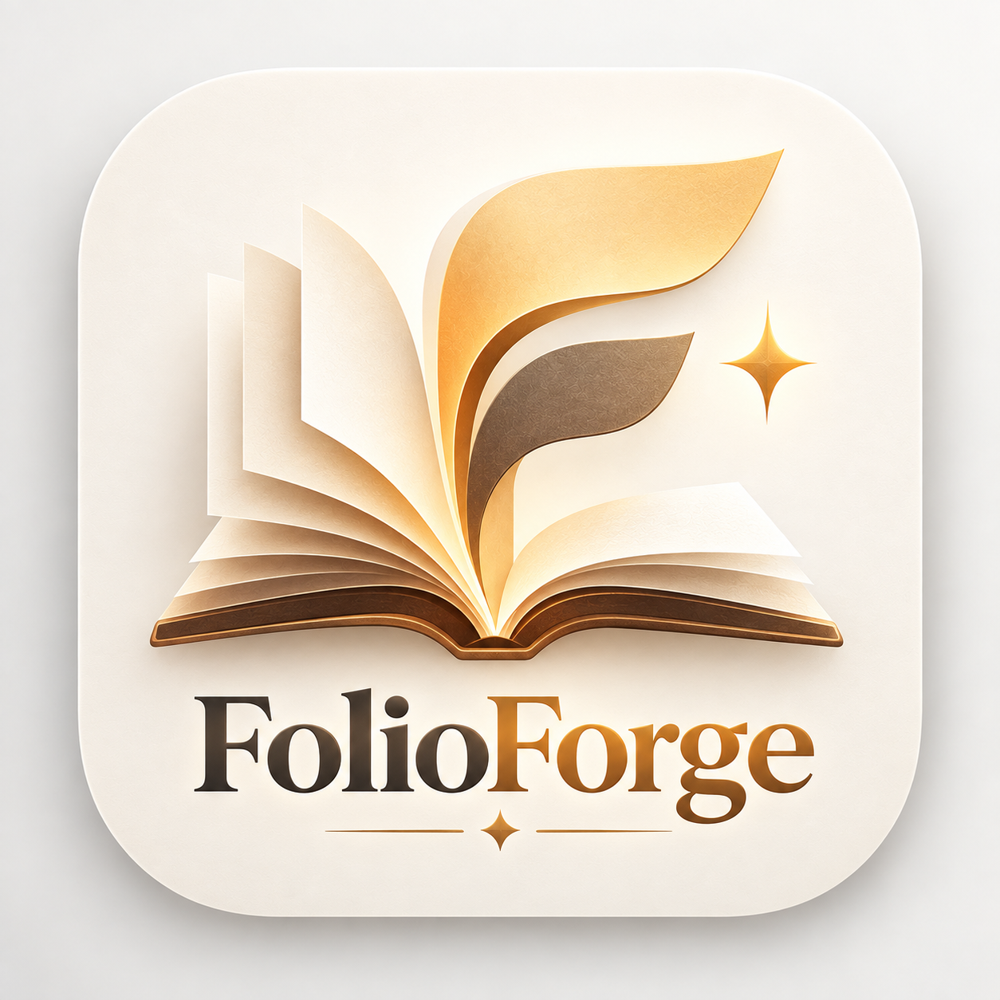

# FolioForge macOS client



The SwiftUI client is a local batch-preparation surface for FolioForge 0.1.0.
It calls the Rust Core through `folio-ffi`; parsing, Semantic IR, compatibility
decisions and export remain outside the views.

## Client contract

- The empty queue opens as a full-window drop zone.
- The batch sidebar contains the current selection, not a permanent Library.
- Selecting a book exposes non-destructive metadata, cover, typography, font,
  style, structure and navigation edits.
- Compatibility preview shows target/device/orientation/font-size projections;
  it is not Kindle Previewer or a device renderer.
- Diagnostics show parser/input loss, compatibility fallbacks, output status
  and recovered KFX evidence without turning absence into a fidelity claim.
- Local conversion is offline. The explicit metadata lookup action sends only
  search terms and requires a merge choice plus confirmation.

The app owns presentation state only. It reads the registered format and target
capabilities from FFI, so the UI cannot drift into a second capability matrix.

The unreleased 0.2 development line adds a separate Comics tab. Its current GUI
scope is image folders and ZIP/CBZ sources, with page order, stable page IDs,
dimensions, thumbnails, preview rendering and CBZ output supplied by Core.
Only CBZ is currently advertised as an output target; device profiles, comic
editing and other comic outputs remain unimplemented. This does not expand the
frozen 0.1 Books workflow or its format claims.

## Build

From the repository root, build the Rust FFI archive and pass it to SwiftPM:

```bash
export FOLIOFORGE_VALIDATION_ROOT="$VALIDATION_VOLUME/folioforge-0.1"
export CARGO_TARGET_DIR="$FOLIOFORGE_VALIDATION_ROOT/cargo-target"
cargo build --locked --release -p folio-ffi
FOLIOFORGE_FFI_ARCHIVE="$CARGO_TARGET_DIR/release/libfolio_ffi.a" \
  swift build --package-path macos/FolioForge \
  --scratch-path "$FOLIOFORGE_VALIDATION_ROOT/swift-debug"
FOLIOFORGE_FFI_ARCHIVE="$CARGO_TARGET_DIR/release/libfolio_ffi.a" \
  swift build --package-path macos/FolioForge \
  --scratch-path "$FOLIOFORGE_VALIDATION_ROOT/swift-release" -c release
```

`packaging/build_macos_app.sh` is the complete arm64 package validation
entry point. It requires `FOLIOFORGE_VALIDATION_ROOT`, keeps compiler/runtime
scratch data there, builds against the macOS 27 floor, embeds the project logo,
leaves the app unsigned and produces a timestamped `0.1.0` app/ZIP under
ignored `dist/` only after validation succeeds.

The package is a SwiftPM executable rather than an Xcode project, so it has no
separate `MARKETING_VERSION` setting; the checked-in bundle plist and Rust/FFI
package version are both `0.1.0`.

The result is deliberately unsigned: the build does not invoke `codesign`, use
certificates or embed entitlements. No Developer ID, notarization or Gatekeeper
acceptance is claimed.
